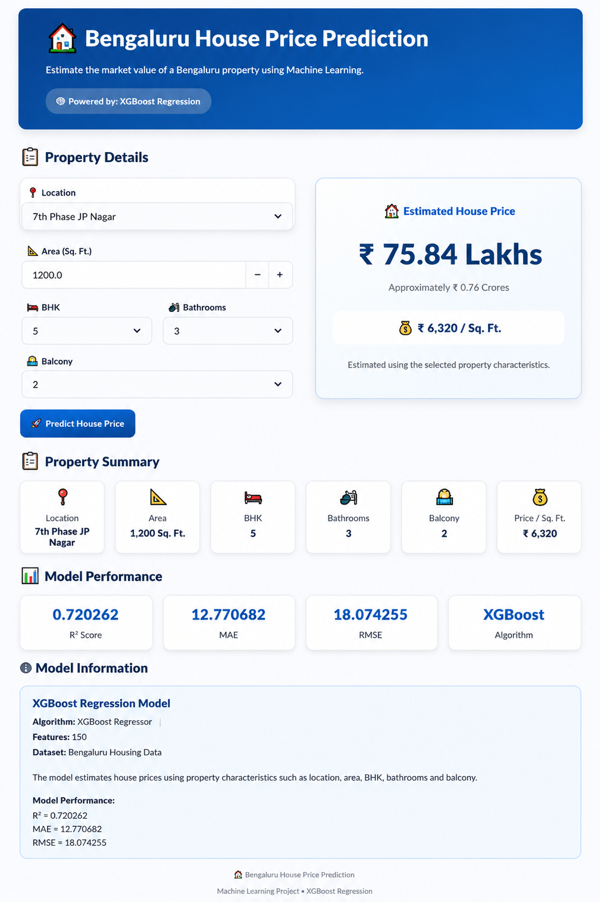

# Bengaluru House Price Prediction

## Machine Learning Based Real Estate Price Estimation

Bengaluru House Price Prediction is an end-to-end machine learning project that estimates residential property prices in Bengaluru, Karnataka.

The project uses property characteristics such as location, area, BHK, bathrooms, balcony availability, and area type to predict an estimated house price using an XGBoost regression model.

The complete workflow includes data preprocessing, exploratory data analysis, feature engineering, categorical encoding, model training, evaluation, model saving, and deployment through an interactive Streamlit application.

---

## Application Preview

The project includes an interactive Streamlit application that allows users to enter property details and receive an estimated house price.

Add a screenshot of your application to:

```text
05_application/
└── house_price_prediction.png
```

Then display it here:

```markdown

```

---

## Project Overview

Bengaluru is one of India's major technology and real estate markets. Property prices can vary significantly depending on location, property size, BHK configuration, bathrooms, balcony availability, and other factors.

This project uses historical Bengaluru housing data to identify relationships between property characteristics and house prices.

The cleaned and processed data is used to train an XGBoost regression model. The trained model is then integrated into a Streamlit application so users can interactively estimate property prices.

The main focus of this project is to demonstrate a complete machine learning workflow from raw data to a usable prediction application.

---

## Objective

The main objective is to build a practical machine learning system that can:

* Clean and prepare real-world housing data
* Perform exploratory data analysis
* Handle missing and inconsistent values
* Engineer useful features
* Encode categorical variables
* Train a regression model
* Evaluate model performance
* Save the trained model
* Generate property price predictions
* Provide an interactive Streamlit application

---

## Key Features

* Location-based house price prediction
* Property area input in square feet
* BHK selection
* Bathroom selection
* Balcony selection
* Area type selection
* Location and area type encoding
* Area-per-BHK feature engineering
* XGBoost regression
* Model performance evaluation
* Estimated price in Indian Lakhs
* Price per square foot calculation
* Property summary
* Interactive Streamlit dashboard

---

## Machine Learning Workflow

```text
Raw Bengaluru Housing Data
            |
            v
      Data Cleaning
            |
            v
 Exploratory Data Analysis
            |
            v
   Feature Engineering
            |
            v
 Categorical Encoding
            |
            v
    Data Preparation
            |
            v
     Train / Test Split
            |
            v
    XGBoost Regression
            |
            v
    Model Evaluation
            |
            v
      Saved Model
            |
            v
  Streamlit Application
            |
            v
    Price Prediction
```

---

## Dataset

The project uses historical Bengaluru residential property data.

The dataset contains property-related information such as:

| Feature       | Description                 |
| ------------- | --------------------------- |
| Area Type     | Type of property area       |
| Location      | Bengaluru property location |
| Total Sq. Ft. | Property area               |
| BHK           | Number of bedrooms          |
| Bath          | Number of bathrooms         |
| Balcony       | Number of balconies         |
| Price         | Property price              |

The raw dataset is not included in the public repository to keep the repository lightweight.

The project separates raw and processed data inside the `01_data` directory.

---

## Data Preprocessing

Real-world housing datasets often contain missing values, inconsistent formats, duplicate observations, and unusual values.

The preprocessing workflow includes:

* Handling missing values
* Removing unnecessary columns
* Cleaning property size information
* Converting area values into numerical format
* Handling inconsistent square-foot values
* Processing BHK information
* Processing bathroom and balcony values
* Removing unsuitable observations
* Handling outliers
* Creating derived features
* Encoding categorical variables

---

## Feature Engineering

Feature engineering is used to create additional information that can help the model understand property characteristics.

One of the important engineered features is:

```text
Area per BHK = Total Area / BHK
```

This feature provides information about the approximate space available per bedroom and can help distinguish between properties with similar total areas but different BHK configurations.

---

## Features Used by the Model

The final prediction dataset contains approximately 150 features after preprocessing and one-hot encoding.

Important features include:

| Feature      | Description                    |
| ------------ | ------------------------------ |
| Area         | Property area in square feet   |
| BHK          | Number of bedrooms             |
| Bath         | Number of bathrooms            |
| Balcony      | Number of balconies            |
| Area Type    | Type of property area          |
| Location     | Property location              |
| Area per BHK | Engineered area-to-BHK feature |

Categorical variables such as location and area type are converted into numerical features using one-hot encoding.

---

## Machine Learning Model

### XGBoost Regressor

The primary model used in this project is XGBoost Regressor.

XGBoost is a gradient boosting algorithm that performs well on structured and tabular datasets. It can capture non-linear relationships between property characteristics and house prices.

**Algorithm:** XGBoost Regressor
**Problem Type:** Regression
**Target Variable:** House Price
**Input Features:** Approximately 150 after preprocessing and encoding

---

## Model Performance

The trained model was evaluated using a separate testing dataset.

| Metric      |       Result |
| ----------- | -----------: |
| Training R² |       77.54% |
| Testing R²  |       72.03% |
| MAE         | ₹12.77 Lakhs |
| RMSE        | ₹18.07 Lakhs |

### Metric Explanation

**R² Score**

R² measures how well the model explains the variation in house prices. A higher value generally indicates better model performance.

**MAE — Mean Absolute Error**

MAE represents the average absolute difference between actual and predicted prices.

**RMSE — Root Mean Squared Error**

RMSE measures prediction error while giving greater importance to larger errors.

---

## Results

The XGBoost model achieved a testing R² score of **72.03%**.

This means the model explains a substantial portion of the variation in the target house prices within the testing dataset.

The final evaluation results were:

```text
Testing R²  : 72.03%
MAE         : ₹12.77 Lakhs
RMSE        : ₹18.07 Lakhs
```

The model provides useful estimated prices, but predictions should not be treated as official property valuations.

---

## Model Evaluation

Evaluation visualizations are stored in the `03_evaluation` directory.

The project includes visualizations such as:

* Training vs Testing R²
* Error metric comparison
* Actual vs Predicted Prices
* Residual Analysis
* Feature Importance

Example files:

```text
03_evaluation/
├── r2_training_vs_testing.png
├── error_metrics.png
├── actual_vs_predicted.png
├── residual_plot.png
└── feature_importance.png
```

These visualizations help understand model performance and identify prediction errors.

---

## Streamlit Application

The project includes an interactive Streamlit application for house price prediction.

Users can enter:

```text
Location
Area Type
Area
BHK
Bathrooms
Balcony
```

The application processes these inputs and generates:

```text
Estimated House Price
Price per Square Foot
Area per BHK
Property Summary
Model Performance
```

The application provides a simple interface for testing different property configurations.

---

## Example Prediction

Example property information:

| Property Detail | Value              |
| --------------- | ------------------ |
| Location        | 7th Phase JP Nagar |
| Area            | 1,200 Sq. Ft.      |
| BHK             | 5                  |
| Bathrooms       | 3                  |
| Balcony         | 2                  |
| Area Type       | Built-up Area      |

The application uses these property characteristics to generate an estimated Bengaluru house price using the trained XGBoost model.

---

## Project Structure

```text
Bengaluru-House-Price-Prediction/
|
├── 01_data/
|   ├── raw/
|   └── processed/
|
├── 02_notebooks/
|   └── model_training.ipynb
|
├── 03_evaluation/
|   ├── r2_training_vs_testing.png
|   ├── error_metrics.png
|   ├── actual_vs_predicted.png
|   ├── residual_plot.png
|   └── feature_importance.png
|
├── 04_model/
|   └── house_price_prediction.pkl
|
├── 05_application/
|   ├── app.py
|   └── house_price_prediction.png
|
├── README.md
├── requirements.txt
├── LICENSE
└── .gitignore
```

---

## Technologies Used

### Programming

* Python

### Data Processing

* Pandas
* NumPy

### Machine Learning

* Scikit-learn
* XGBoost

### Data Visualization

* Matplotlib

### Web Application

* Streamlit

### Model Serialization

* Pickle

### Development Tools

* Jupyter Notebook
* VS Code
* Git
* GitHub

---

## Installation

### 1. Clone the Repository

```bash
git clone https://github.com/s56874/Bengaluru-House-Price-Prediction.git
```

### 2. Navigate to the Project Directory

```bash
cd Bengaluru-House-Price-Prediction
```

### 3. Install Dependencies

```bash
pip install -r requirements.txt
```

---

## Running the Application

Navigate to the application directory:

```bash
cd 05_application
```

Start the Streamlit application:

```bash
streamlit run app.py
```

The Streamlit application will start locally and provide a URL that can be opened in a web browser.

---

## Model Training

The machine learning workflow is documented in the `02_notebooks` directory.

The training process includes:

1. Loading the housing dataset
2. Understanding the dataset
3. Handling missing values
4. Cleaning inconsistent data
5. Handling outliers
6. Performing exploratory data analysis
7. Creating engineered features
8. Encoding categorical variables
9. Splitting the dataset
10. Training the XGBoost regression model
11. Evaluating model performance
12. Saving the trained model

---

## Saved Model

The trained model is stored in the `04_model` directory.

```text
04_model/
└── house_price_prediction.pkl
```

The saved model allows the Streamlit application to load the trained model without retraining it every time the application starts.

---

## Limitations

This project provides a machine learning-based estimate and should not be considered an official property valuation.

Actual property prices can differ because of factors that may not be represented in the dataset, including:

* Exact property location
* Property condition
* Building age
* Floor
* Road connectivity
* Amenities
* Neighborhood development
* Current market demand
* Economic conditions
* Property-specific characteristics

The model is trained using historical housing data, so its predictions may not perfectly represent current Bengaluru market prices.

---

## Future Improvements

Possible improvements for future versions include:

* Add more recent Bengaluru housing data
* Improve location-level prediction accuracy
* Add additional property features
* Perform hyperparameter optimization
* Use cross-validation
* Compare XGBoost with Random Forest and other regression algorithms
* Improve outlier detection
* Add interactive model analytics
* Add feature importance visualization
* Add prediction ranges
* Deploy the application online
* Implement automated model retraining

---

## Learning Outcomes

This project provided practical experience in:

* Real-world data cleaning
* Exploratory data analysis
* Feature engineering
* Categorical encoding
* Regression algorithms
* XGBoost
* Model evaluation
* Model serialization
* Streamlit application development
* Git and GitHub
* End-to-end machine learning workflow

---

## Author

### Samarth Kokate

B.Tech Computer Engineering / Data Science

Areas of Interest:

**Machine Learning | Data Science | Python | Data Analytics**

---

## Project Information

| Category              | Details                            |
| --------------------- | ---------------------------------- |
| Project               | Bengaluru House Price Prediction   |
| Domain                | Real Estate Analytics              |
| Machine Learning Task | Regression                         |
| Primary Model         | XGBoost Regressor                  |
| Programming Language  | Python                             |
| Web Framework         | Streamlit                          |
| Dataset               | Bengaluru Residential Housing Data |

---

## License

This project is licensed under the MIT License.

See the `LICENSE` file for the complete license text.

---

## Acknowledgement

This project was developed as a practical machine learning project to apply data preprocessing, feature engineering, regression modeling, model evaluation, and application development to a real-world housing price prediction problem.

---

## Conclusion

Bengaluru House Price Prediction demonstrates how machine learning can be applied to structured real-estate data to build an end-to-end prediction system.

The project combines data preparation, feature engineering, XGBoost regression, model evaluation, and Streamlit deployment into a single workflow.

The resulting application provides an accessible way to experiment with property characteristics and obtain estimated Bengaluru house prices.

---

**Bengaluru House Price Prediction**

**Python | XGBoost | Scikit-learn | Pandas | NumPy | Matplotlib | Streamlit**
